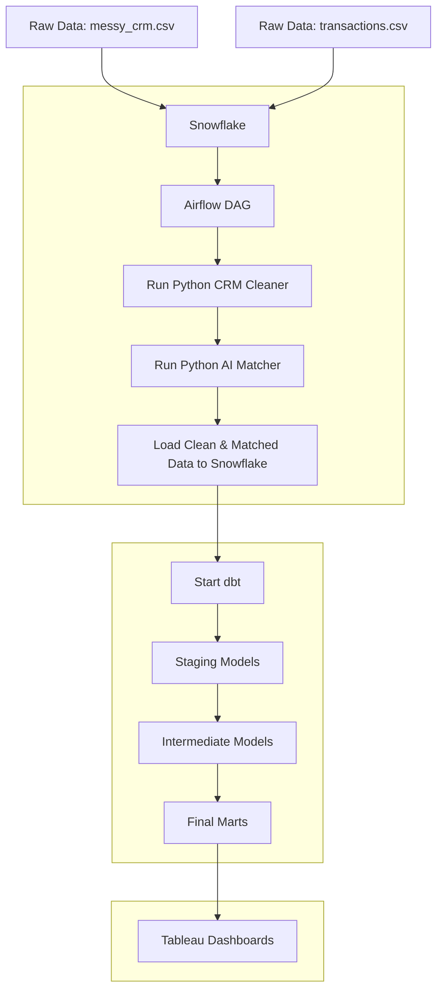

# End-to-End Business Development ROI Pipeline

This project demonstrates a complete, end-to-end data engineering and AI workflow to solve a critical business problem: **measuring the ROI of a business development (BD) team.**

#### Code Highlights (For Reviewers)
If you want to jump straight to the coding/SQL:
* **The AI/ML Engine:** [AI/ML Name Matching (Python)](https://github.com/mmatlock91/bd-roi-data-pipeline/blob/main/2_orchestration/airflow-docker/dags/name_matching_dag.py)
* **The Transformation Logic:** [dbt Data Marts (SQL)](https://github.com/mmatlock91/bd-roi-data-pipeline/tree/main/3_dbt_models/models/3_marts)

**This repo shows an end to end business development team analytics pipeline:**

* Clean and key CRM accounts, then match them to transactions using AI based name matching
* Model the data in dbt and load into Snowflake
* Power Tableau dashboards that measure unmanaged opportunity, BD performance, leads, and conversion lift

The central challenge was that key insights were locked behind systemic data failures. It was impossible to link transactions to the CRM, preventing any meaningful analysis.

This project showcases a tri-expertise solution:
1.  **Data Engineering:** Solving core data integrity and architecture flaws.
2.  **Data Science:** Developing a matching algorithm to bridge the gap between disparate datasets.
3. **Data Analytics:** Quantifying the financial impact and true ROI of the business development organization.

> **Disclaimer:** This project is inspired by a real production pipeline I designed at a large tech company. All data is fully synthetic and all metrics are illustrative only.

---

### The Core Challenges & Solutions

The project was blocked by two major technical hurdles:

**1. The Data Engineering Challenge: No Reliable Key**
* **Problem:** The CRM data, our source of truth for "managed" accounts, had no unique keys. The `id` column was unreliable and contained duplicates due to a systemic data source issue.
* **Solution:** I engineered a new, reliable surrogate key. This was achieved by:
    *  Identifying two stable business assets (e.g., `company_name`, `market`).
    *  Creating a composite key from these assets.
    *  Generating a **SHA-256 hash** of this composite key to create a truly unique and stable surrogate key for every account.

**2. The Data Science Challenge: No Join Condition**
* **Problem:** The `transactions` data had no foreign key to the CRM. The only link was a `merchant_name` field, which was inconsistent, user-entered text (e.g., "Turkish Airlines" vs. "TURKISH-AIR").
* **Solution:** I developed an **AI/ML name-matching algorithm** that could intelligently match the inconsistent merchant names from the transaction data to the clean `company_name` in the CRM.

**3. The Result:** This algorithm successfully matched millions of records with 95+% accuracy, and assigned the new surrogate key to millions of transaction records, creating the clean, reliable link needed to finally measure managed vs. unmanaged spend.

---

### Key Business Insights Unlocked
After engineering the data link, the pipeline was built to answer these critical questions:

* **What is the total unmanaged spend opportunity?** 
* **What is the performance of individual BD managers?** 
* **Who are our top unowned merchants to target?** 
* **What is the measurable spend-lift from converting a merchant?** 

---

### Tech Stack
* **Data Cleaning & AI:** Python (pandas, scikit-learn, rapidfuzz, faiss, sentencetransformers)
* **Orchestration:** Apache Airflow (Docker)
* **Data Transformation:** dbt (Data Build Tool)
* **Data Warehouse:** Snowflake
* **Visualization:** Tableau

---

### Project Architecture & Data Flow



---

### Repository Structure

```text
Business-Development-ROI-Project/
├── 1_data/
│   ├── 1_unclean/
│   │   ├── transactions.csv
│   │   └── uncleaned_crm_details.csv
│   └── 2_cleaned_matched_data/
│       ├── crm_details.csv
│       └── transactions_matched.csv
│
├── 2_orchestration/
│   └── airflow-docker/
│       ├── config/
│       ├── dags/
│       │   ├── clean_crm_dag.py
│       │   └── name_matching_dag.py
│       ├── Dockerfile
│       ├── docker-compose.yaml
│       └── requirements.txt
│
├── 3_dbt_models/
│   ├── dbt_project.yml
│   ├── models/
│   │   ├── _sources_bd_data.yml
│   │   ├── 1_staging/
│   │   ├── 2_intermediate/
│   │   └── 3_marts/
│   └── logs/
│
├── 4_visualization/
│   └── Sample_Dashboard.twb
│
└── README.md
```


---

### Key Dashboards & Insights

1.  **Dashboard 1: ROI, Opportunity, & Conversion Impact**
    * **Insight:** A unified executive view that quantifies a multi-billion dollar opportunity and proves the financial value of the account management team.
2.  **Dashboard 2: Account Management Team Performance**
    * **Insight:** A managerial scatter plot that identifies different "All-Star" profiles: "Rainmakers" (high ACV) vs. "Farmers" (high spend-to-CV ratio).
3.  **Dashboard 3: Account Lead Generation**
    * **Insight:** A tactical, actionable dashboard providing two prioritized call lists: **"Top Unmanaged Targets"** and **"Unmanaged Churn Risk."**

---

### How to Run

1.  **Configure dbt:** Create a `profiles.yml` file in your `~/.dbt/` directory with your Snowflake credentials.
2.  **Start Airflow:** `cd 2_orchestration/airflow-docker && docker-compose up`
3.  **Trigger Airflow DAG:** Open the Airflow UI at `http://localhost:8080` and trigger the `clean_and_run_dbt` DAG. This will run the Python cleaning scripts and then execute the dbt models.
4.  **View Dashboards:** Once the dbt run is complete, open `4_visualization/Sample_Dashboard.twb` and refresh the data source to see the final results.